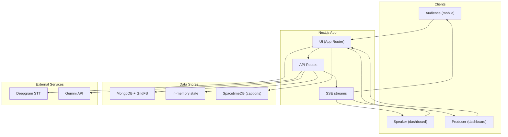

# High-Level Architecture

This diagram summarizes the primary runtime components and external dependencies for PULSE.

Notes:
- Clients consume SSE streams for signals, captions, suggestions, and interventions.
- SpacetimeDB holds caption rows; MongoDB + GridFS persist sessions, summaries, suggestions, and audio.
- Gemini powers interventions, summaries, suggester, and chat; ElevenLabs is used for optional TTS.
