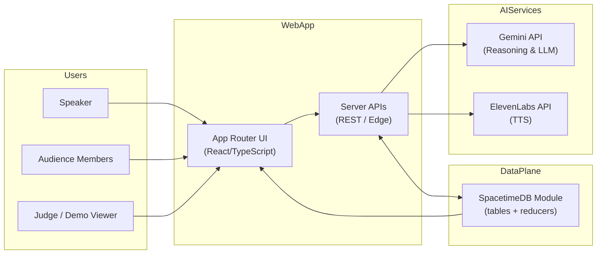
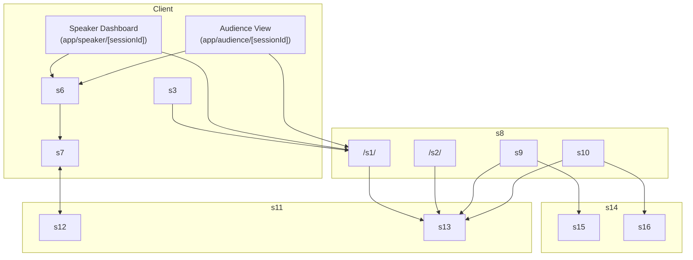
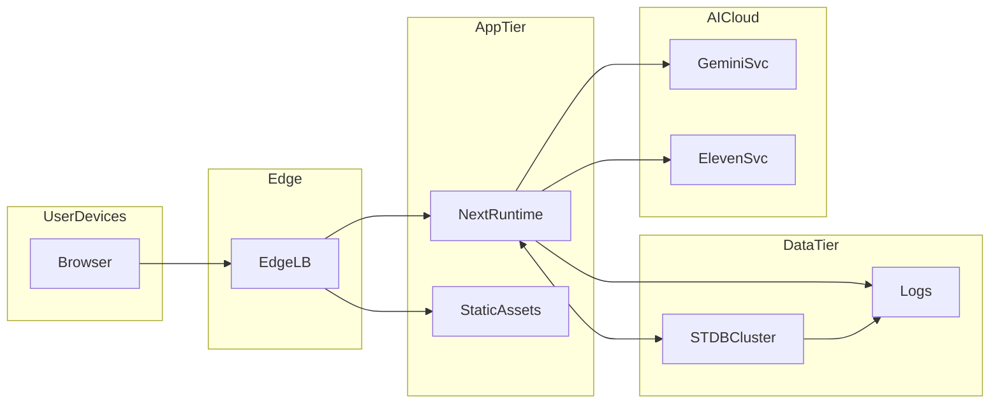
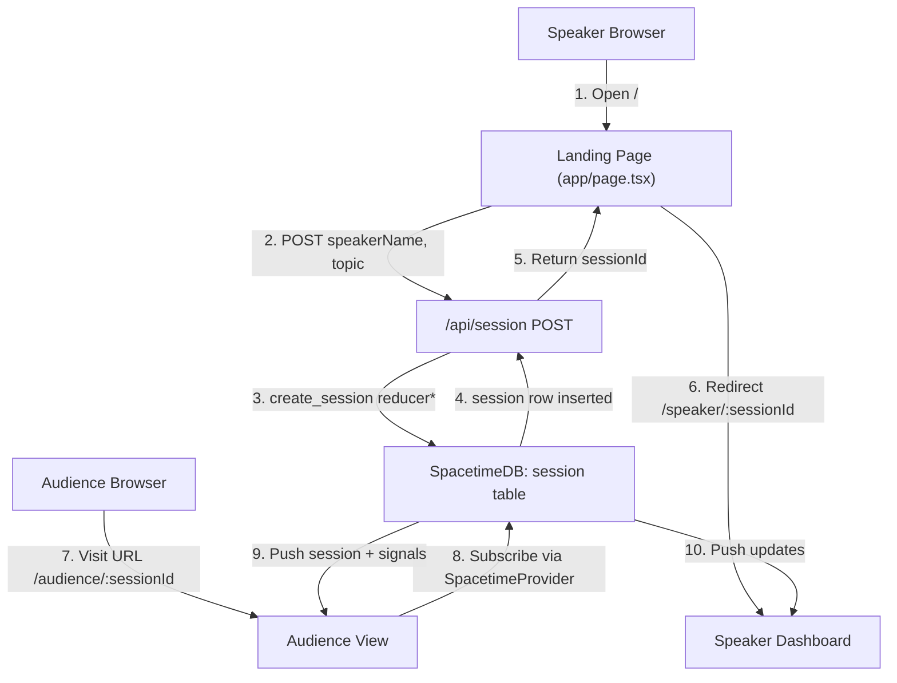
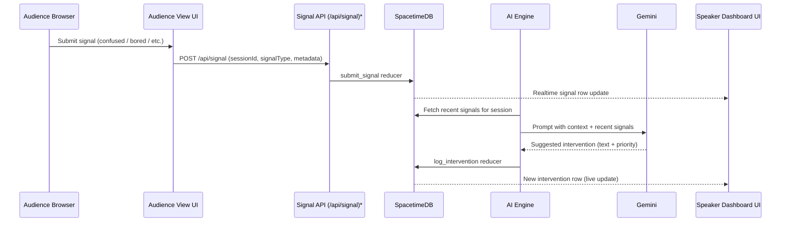
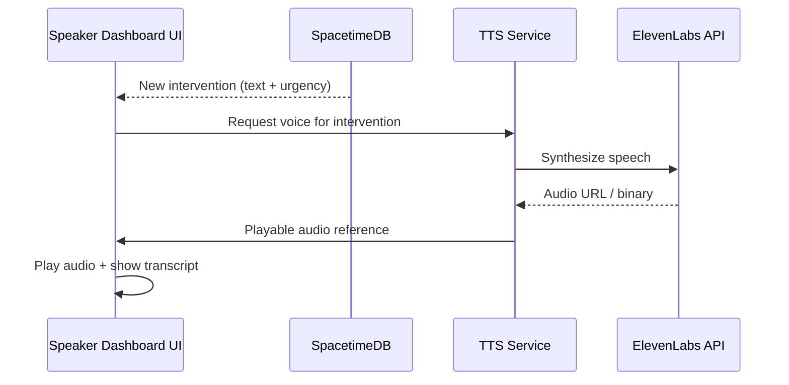
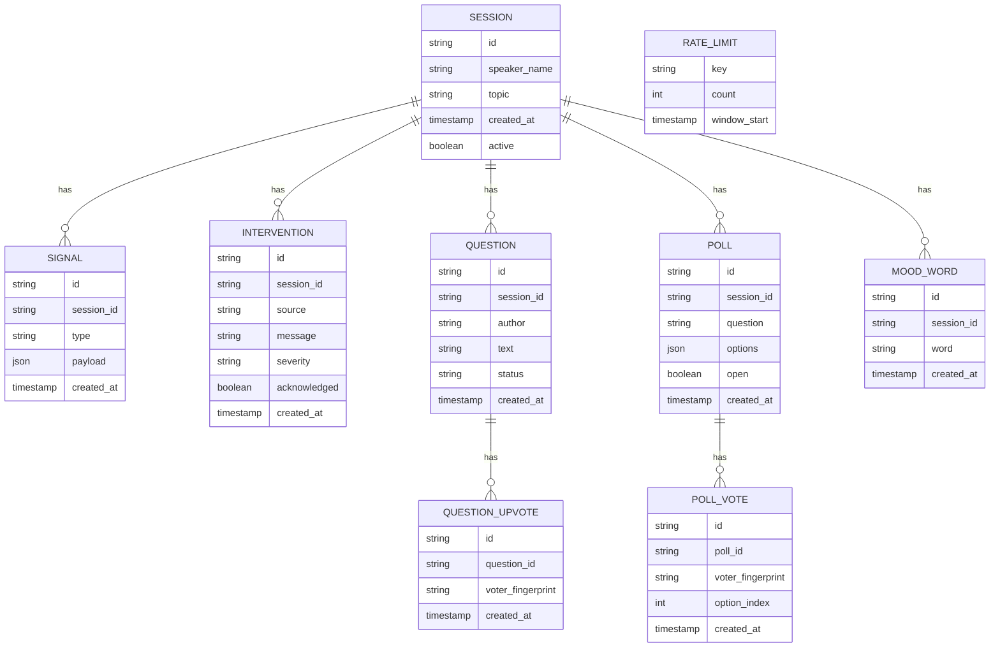

## Executive Summary

PULSE is a real-time, AI-augmented “room whisperer” that helps speakers monitor audience engagement and receive just-in-time coaching during live sessions. The system combines a Next.js web application, SpacetimeDB for low-latency state synchronization, and AI services (Gemini and ElevenLabs) to ingest audience signals, reason about engagement, and surface interventions to the speaker.  

The architecture is cloud-native, event-driven, and optimized for real-time collaboration: speakers and audiences connect via web clients, all shared state lives in SpacetimeDB, and AI services are orchestrated via stateless server-side functions and APIs.

---

## System Context

### System Context Diagram

### Explanation

- **External actors**
  - Speaker: creates sessions, views interventions and live engagement.
  - Audience members: join sessions, send signals (mood, questions, polls).
  - Judge: views flows during the demo; uses same UI.

- **Core system**
  - Next.js web app (App Router) serves UI and APIs.
  - SpacetimeDB cluster hosts all shared, real-time state (session, signals, questions, polls, etc.).
  - AI services (Gemini, ElevenLabs) are invoked by server APIs to analyze signals and generate interventions/voice.

- **Interactions**
  - Users interact via browser → Next.js UI → APIs.
  - APIs read/write state through SpacetimeDB reducers.
  - APIs call Gemini for reasoning and ElevenLabs for audio output.
  - SpacetimeDB pushes live updates to connected clients via WebSockets.

### NFR Coverage

- **Scalability**: Horizontally scalable web app and SpacetimeDB cluster; stateless APIs; AI services scale independently.
- **Performance**: WebSocket-based SpacetimeDB updates; minimal server-side logic in hot paths; client-side subscriptions.
- **Security**: Sessions scoped by opaque IDs; environment secrets for AI APIs; future auth pluggable at API boundary.
- **Reliability**: Centralized state in SpacetimeDB; stateless Next.js layers; graceful degradation if AI is down.
- **Maintainability**: Clear separation between UI, APIs, SpacetimeDB module, and AI orchestration.

---

## Architecture Overview

PULSE follows a **hub-and-spokes** architecture:

- Next.js app is the interaction hub.
- SpacetimeDB acts as the real-time data backbone.
- AI services (Gemini, ElevenLabs) are downstream “spokes” invoked via well-defined server APIs.
- Clients are thin: they subscribe to state (via SpacetimeProvider + useSpacetimeSession) and render views; most business logic lives in reducers and server APIs.

Key patterns:

- **Event-driven**: Audience actions → signals written into SpacetimeDB → AI processors react and generate interventions.
- **CQRS-style separation**: Reducers for writes; subscriptions/hooks for reads.
- **Micro-frontends inside App Router**: Speaker dashboard, audience view, and admin/demo views are separate routes over shared state.

---

## Component Architecture

### Component Diagram

\* `SignalAPI` is a planned component for later phases.

### Component Responsibilities

- **Client**
  - **Landing**: Create session (Phase 1), redirect speaker to dashboard.
  - **SpeakerUI**: Display engagement, questions, polls, AI interventions.
  - **AudienceUI**: Collect signals, questions, votes, mood.
  - **SpacetimeProvider**: Manage WebSocket connection and subscriptions.
  - **useSpacetimeSession**: Project SpacetimeDB tables into convenient React data and reducer callers.

- **Server**
  - **SessionAPI** (`/api/session`): Create and retrieve sessions; later, delegate to `create_session` reducer.
  - **SignalAPI**: Entry point for non-WebSocket actions (e.g., REST endpoints for signals/polls where needed).
  - **AIEngine**: Pulls recent signals, calls Gemini, decides if/what intervention to log.
  - **TTSService**: Uses ElevenLabs to generate audio and store references (URLs) in SpacetimeDB.

- **SpacetimeDB Module**
  - **Tables**: Represent domain entities (session, signal, intervention, question, poll, etc.).
  - **Reducers**: Enforce invariants and handle mutations: session lifecycle, signal submission, AI interventions, question moderation, poll management.

- **External Services**
  - **Gemini API**: LLM reasoning for engagement assessment and suggestion generation.
  - **ElevenLabs API**: Voice synthesis for interventions.

### NFR Coverage

- **Scalability**: Each component can scale independently; AIEngine/TTSService can run as background workers or lambdas.
- **Performance**: Real-time updates rely on WebSockets and reducers; UI re-renders only on table changes.
- **Security**: AI keys never reach clients; all calls go through server-side layers.
- **Reliability**: Reducers centralize business rules; AIEngine can be retried or run idempotently.
- **Maintainability**: Strong domain boundaries: UI vs APIs vs Spacetime module vs AI orchestration.

---

## Deployment Architecture

### Deployment Diagram

### Explanation

- **Environments**: At minimum, dev and production; both share the same topology but differ in scale and credentials.
- **Network boundaries**:
  - Public internet → Edge/CDN → Next.js runtime (public zone).
  - Next.js runtime → SpacetimeDB (protected zone, private network/VPC).
  - Next.js runtime → AICloud (outbound-only HTTPS to external providers).

### NFR Coverage

- **Scalability**: Edge/CDN caches static assets; Next.js runtime scales horizontally; SpacetimeDB cluster horizontally or vertically.
- **Performance**: CDN reduces latency; SpacetimeDB is optimized for low-latency real-time updates.
- **Security**: Private networking for data tier; HTTPS between all public hops; secret management for API keys.
- **Reliability**: Independent scaling and failure domains (app vs data vs AI); logs centrally stored for debugging.
- **Maintainability**: Clear environment separation; infra-as-code can manage all tiers consistently.

---

## Data Flow

### Data Flow Diagram – Session Creation & Participation

\* In the current Phase 1 implementation, step 3 is temporarily backed by in-memory storage via `/api/session`; later it will be switched to the `create_session` reducer.

### Explanation

- Session creation is initiated from the landing page via `/api/session`.
- Once created, both speaker and audience pages load session details and subscribe to SpacetimeDB for ongoing updates.
- Subsequent flows (signals, questions, polls) follow similar patterns: client → reducer → table → subscribed clients.

### NFR Coverage

- **Scalability**: Minimal state in app tier; all shared state centralised in SpacetimeDB.
- **Performance**: Round-trips are small; high-frequency updates stay within WebSocket channels.
- **Security**: Session IDs are opaque; no PII beyond names/topics by design.
- **Reliability**: If AI or some APIs fail, core session flows still work via SpacetimeDB.
- **Maintainability**: Clear lifecycle per entity (session, signal, question, poll) mapped to reducers.

---

## Key Workflows

### Sequence Diagram – Audience Signal → AI Intervention

\* `API` may be bypassed if client uses generated SpacetimeDB bindings directly; for the hackathon a REST endpoint is convenient and demo-friendly.

### Sequence Diagram – Intervention → Voice Output

---

## Additional Diagrams

### Domain Model (ERD-Level) – SpacetimeDB Schema

---

## Phased Development

### Phase 1: Initial Implementation (Current State)

- **Already implemented**
  - Next.js app scaffold with App Router, Tailwind, TypeScript.
  - SpacetimeDB module with all tables and reducers.
  - SpacetimeProvider and useSpacetimeSession.
  - `/api/session` (currently in-memory), landing page, audience and speaker shells.
  - Basic session lifecycle: create, join by URL, display header/session info.

- **Architecture simplifications**
  - `/api/session` not yet wired to SpacetimeDB `create_session`.
  - No AIEngine/TTSService yet; interventions and signals not active.
  - Judge/demo view uses same routes.

### Phase 2–N: Full Architecture

- **Integrate `/api/session` with SpacetimeDB**
  - Replace in-memory store with `create_session` reducer and `session` table reads.
- **Signals & engagement**
  - Audience clients send signals via Spacetime reducers or `/api/signal`.
  - Speaker dashboard visualizes aggregated mood, trends, questions, polls.
- **AI Engine**
  - Scheduled or event-driven workers read `signal` and `question` tables, call Gemini, and log interventions.
- **TTS & multimodal feedback**
  - ElevenLabs used for audio interventions.
  - Optional Web Speech API on client for voice capture.
- **Admin/demo tooling**
  - Replay sessions, export logs, synthetic signals for demos.

### Migration Path

- Start from in-memory `/api/session` → bridge in `create_session` reducer and migrate existing sessions as needed.
- Incrementally roll out:
  - Step 1: Spacetime-backed sessions.
  - Step 2: Audience signals + basic visualizations.
  - Step 3: AIEngine read-only analysis; interventions logged but flagged as “beta”.
  - Step 4: Enable TTS and interactive interventions.

---

## Non-Functional Requirements Analysis

### Scalability

- Stateless Next.js APIs; horizontal scaling via containers/serverless.
- SpacetimeDB designed for real-time, multi-client scenarios; cluster mode for high concurrency.
- AI calls can be rate-limited and batched; AIEngine is horizontally scalable.

### Performance

- WebSockets minimize polling; only deltas propagate to clients.
- Reducers keep business logic close to data, reducing round-trips.
- Use of CDN and static asset optimization for fast initial load.

### Security

- Environment variables for all secrets; no keys in client bundle.
- Opaque session IDs; no sensitive data stored by default.
- Future-ready for auth (JWT, OAuth) around moderator / speaker roles.

### Reliability

- Single source of truth for state in SpacetimeDB.
- Stateless app tier; straightforward blue/green or rolling deployments.
- AI failures degrade gracefully to non-AI functionality.

### Maintainability

- Clear module boundaries (UI, API, Spacetime module, AI orchestration).
- Strong domain schema in Spacetime module that maps to business language.
- App Router-based route structure aligns with business screens (speaker, audience).

---

## Risks and Mitigations

- **AI dependency risk**: Gemini or ElevenLabs outages.
  - Mitigation: Fallback to text-only interventions; circuit breakers; feature flags.
- **Real-time complexity**: Hard-to-debug race conditions or state drift.
  - Mitigation: Centralize all writes in reducers; use logs and replay tools; strict typing.
- **Cost risks**: AI calls and TTS usage can spike costs.
  - Mitigation: Rate limiting; sampling; offline processing where possible.
- **Privacy concerns**: If extended to more personal cues.
  - Mitigation: Minimal data collection; clear consent flows; anonymization where applicable.

---

## Technology Stack Recommendations

- **Frontend**
  - Next.js (already chosen), React 19, Tailwind CSS v4.
  - WebSockets via SpacetimeDB client.
- **Backend**
  - Next.js server functions (Node or serverless).
  - Background workers / serverless functions for AIEngine and TTSService.
- **Data and Real-Time**
  - SpacetimeDB for all shared state.
  - Optional secondary store (e.g., object storage) for long-term analytics later.
- **AI & Media**
  - Gemini API for reasoning and content generation.
  - ElevenLabs API for TTS.
