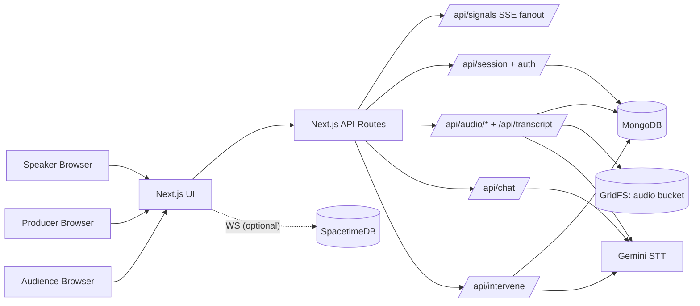
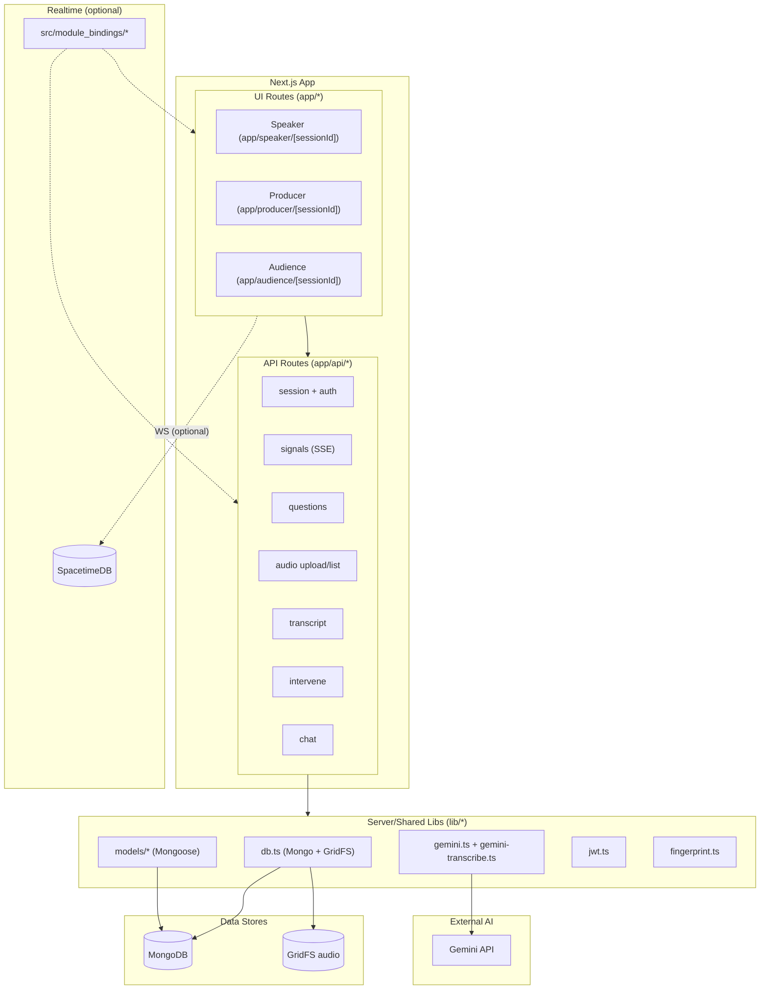
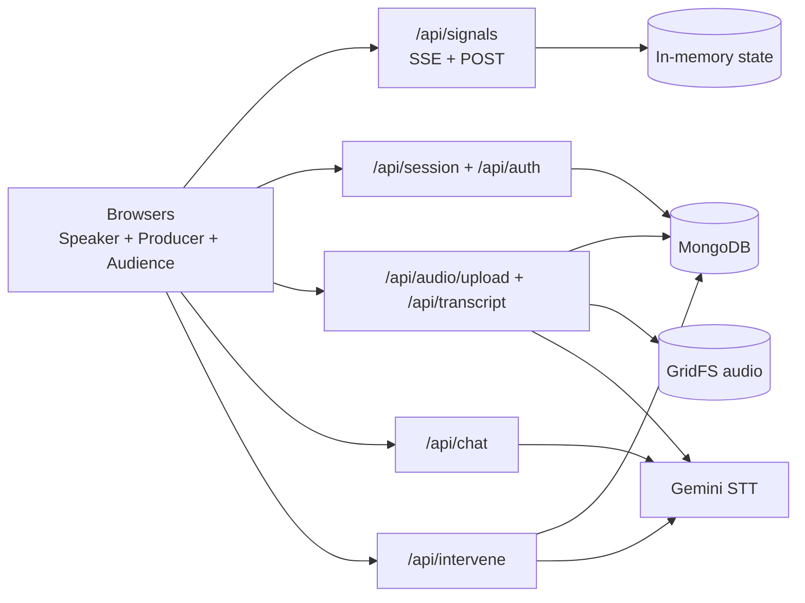
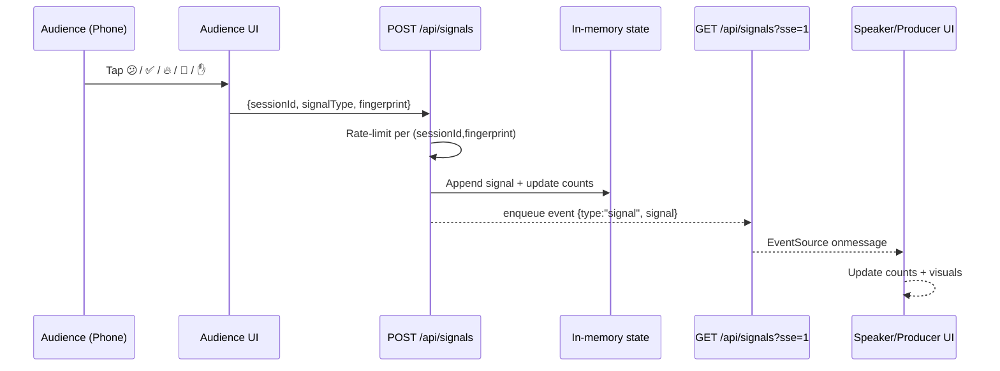
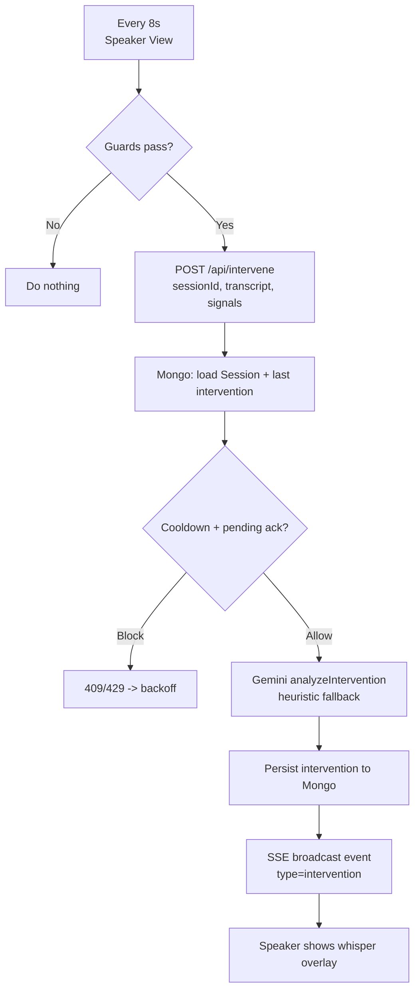
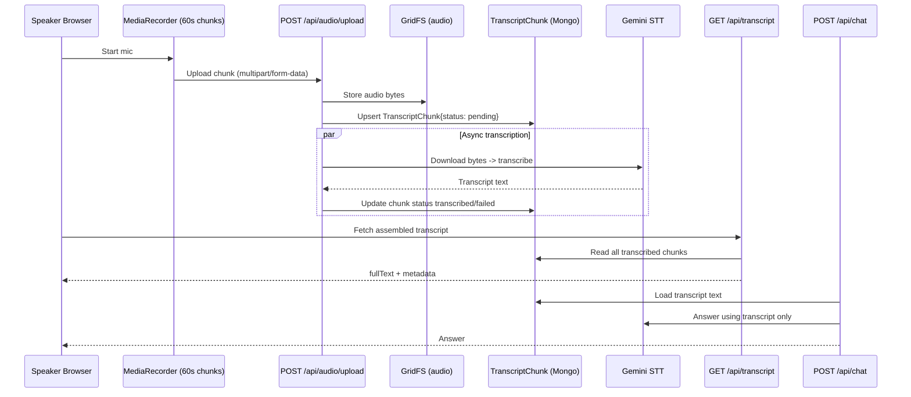
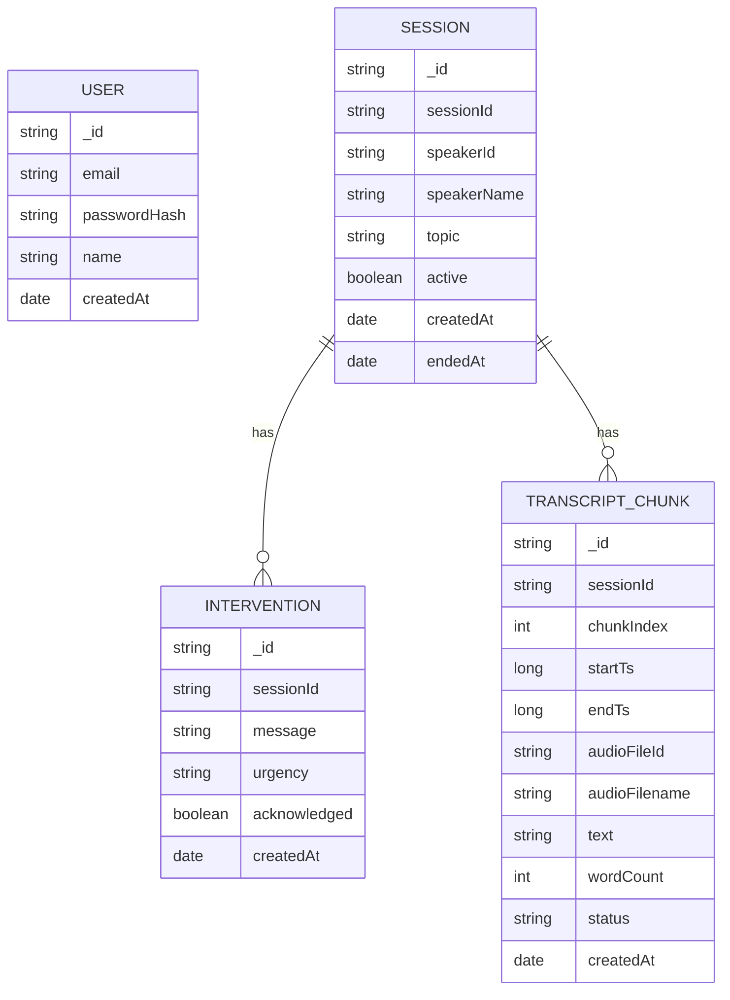
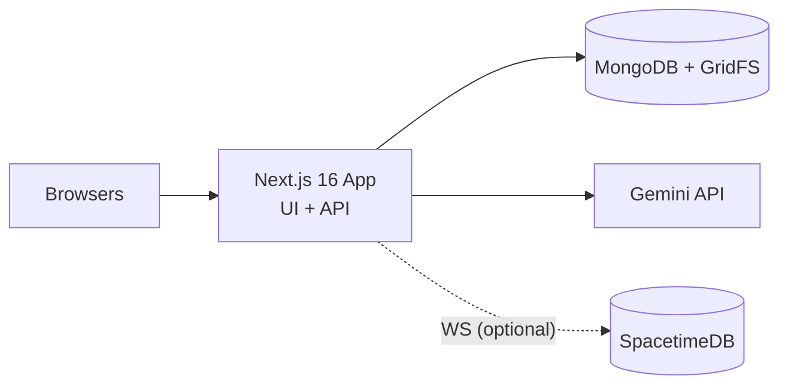

# PULSE — Architecture Plan (Updated)

Last updated: 2026-04-04

## Executive Summary

PULSE is a real-time, AI-assisted “room whisperer” for live talks.

- Audience members send lightweight feedback (signals + questions) from their phones.
- Speaker and producer dashboards receive near-real-time updates via **Server-Sent Events (SSE)**.
- The system records **60s audio chunks**, stores them durably, and uses **Gemini speech-to-text (STT)** to build a transcript.
- Interventions are generated via **Gemini reasoning** when confusion/pacing signals cross simple thresholds.

The current implementation is:

- **Next.js 16 (App Router)**: UI + API routes.
- **MongoDB (Mongoose)**: durable documents (sessions, interventions, transcript chunks, users).
- **GridFS**: durable audio blobs (uploaded chunks).
- **SSE + in-memory state**: real-time fanout for signals and intervention events.
- **Gemini**: STT transcription + transcript-grounded chat + intervention reasoning.
- **SpacetimeDB (present, optional)**: a realtime module + generated client bindings exist in the repo; it is not required for the core signals/transcript flow.

Non-goals for this document: endpoints that do not exist under `app/api/`.

---

## System Context

### What’s true in code today

- **Transcript source of truth** is server-side (Gemini STT) via `/api/audio/upload` → async transcription → `TranscriptChunk` in MongoDB.
- **Signals source of truth** is in-memory per Next.js process; clients subscribe via SSE (`/api/signals?sse=1`).

### SpacetimeDB (present in the repo)

SpacetimeDB is present as a separate module and client wiring:

- Module package: `spacetime/`
- Generated client bindings: `src/module_bindings/`
- Client integration points: `components/SpacetimeProvider.tsx` and `lib/useSpacetimeSession.ts`

It is not required for the core SSE + MongoDB + Gemini STT pipeline described above.

---

## Project Modules (Repo-Level Architecture)

This diagram is intentionally “whole-project” and shows the repo split into modules.

---

## Implemented API Surface (Current)

- **Auth**
  - `POST /api/auth/register`, `POST /api/auth/login`, `GET /api/auth/me` (httpOnly cookie JWT)
- **Session lifecycle**
  - `POST /api/session`, `GET /api/session?sessionId=...`
  - `POST /api/session/start`, `POST /api/session/end`
  - `GET/POST /api/session/primary` (assign “primary judge”)
- **Signals (SSE)**
  - `POST /api/signals` (rate-limited per fingerprint)
  - `GET /api/signals?sessionId=...&sse=1` (SSE) or without `sse=1` for snapshot
- **Questions (in-memory + polling)**
  - `POST /api/questions` (rate-limited; stored in-memory)
  - `GET /api/questions?sessionId=...&primaryOnly=1` (producer uses this)
- **Interventions**
  - `POST /api/intervene` (Gemini reasoning; persists to MongoDB; broadcast to clients)
  - `GET /api/intervene?sessionId=...` (last 10)
- **Audio + transcription**
  - `POST /api/audio/upload` (store chunk to GridFS; async Gemini STT; write `TranscriptChunk`)
  - `GET /api/audio/list?sessionId=...`
  - `GET /api/transcript?sessionId=...` (assemble transcript)
- **Transcript-grounded chat**
  - `POST /api/chat` (answers using transcript only; heuristic fallback when Gemini is not configured)

---

## Component Architecture (Implementation-Level)

---

## Key Data Flows

### 1) Audience Signal → SSE Fanout → Speaker/Producer Updates

### 2) Speaker Intervention Loop (Cooldown + Pending Ack)

### 3) Audio Upload → GridFS → Async Gemini STT → Transcript + Chat

---

## Data Model

### MongoDB (durable)

### GridFS (durable blobs)

- `audio` bucket — uploaded MediaRecorder chunks.

---

## Deployment Architecture

---

## Known Gaps (docs vs repo)

Some older docs in this repo describe endpoints like `/api/poll`, `/api/mood`, `/api/clarify`, and a richer enforcement layer. Those are **not implemented** under `app/api/`.

This document intentionally describes only what’s currently implemented.

---

## Not Currently Used (present in repo)

The codebase includes a few pieces that exist but are not required for the core path above:

- **ElevenLabs TTS**: `/api/tts` and optional TTS logic in `/api/intervene` exist, but the current UI does not request TTS by default.
- **Live captions via Web Speech + SpacetimeDB**: client wiring exists, but it is not part of the server-side transcript source of truth (Gemini STT is).

---

## Optional / Planned (Design Intent)

Documented in `SUPERPLANE_INTEGRATION.md` and `Docs/Superplane.md` as likely next steps:

- Move in-memory SSE state (signals/questions) to a durable realtime store to support horizontal scaling.
- Add moderation and additional interaction types (polls, mood prompts) once corresponding routes exist.
- Add orchestration around AI calls (idempotency, retries, observability).
