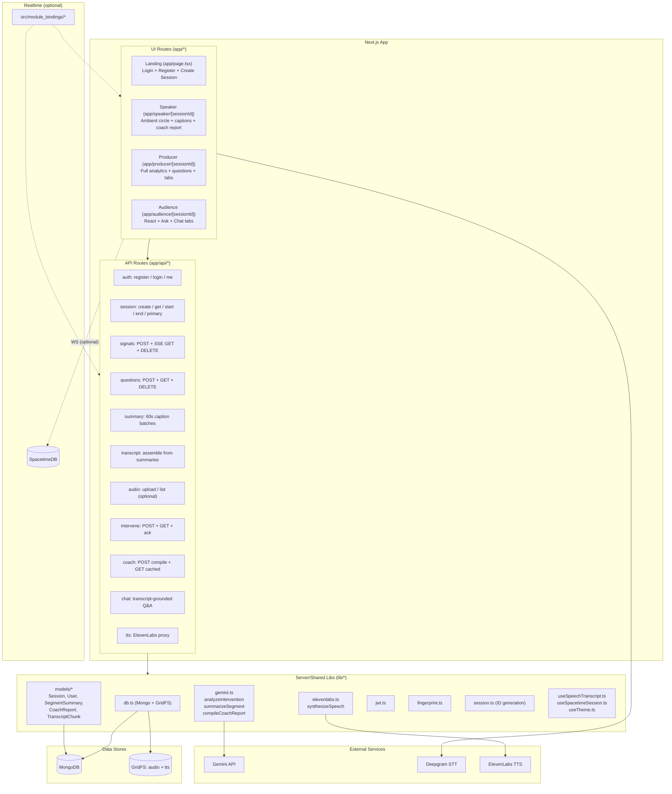
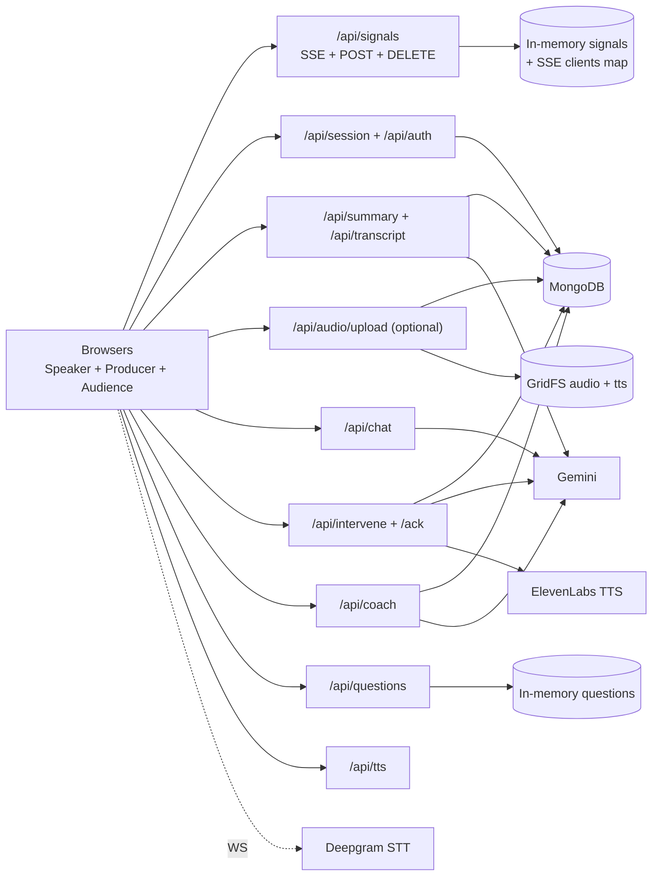
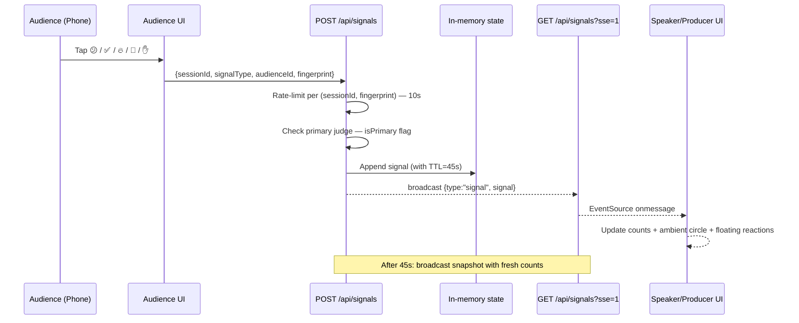
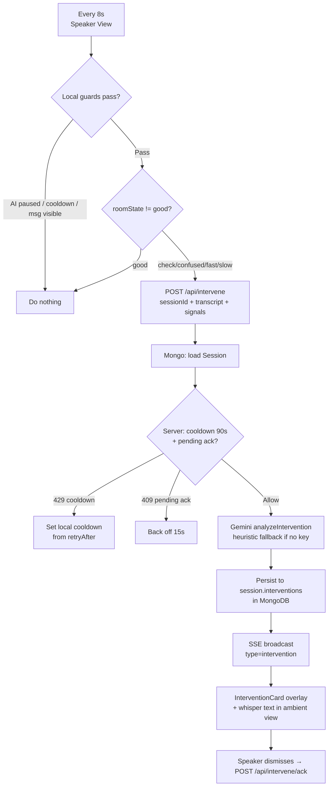
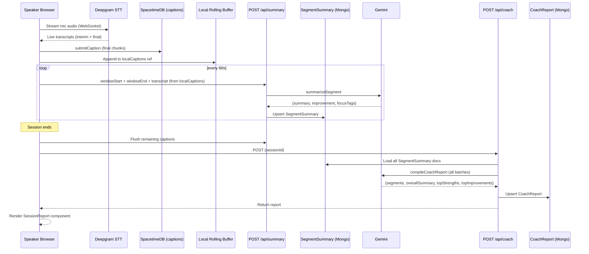
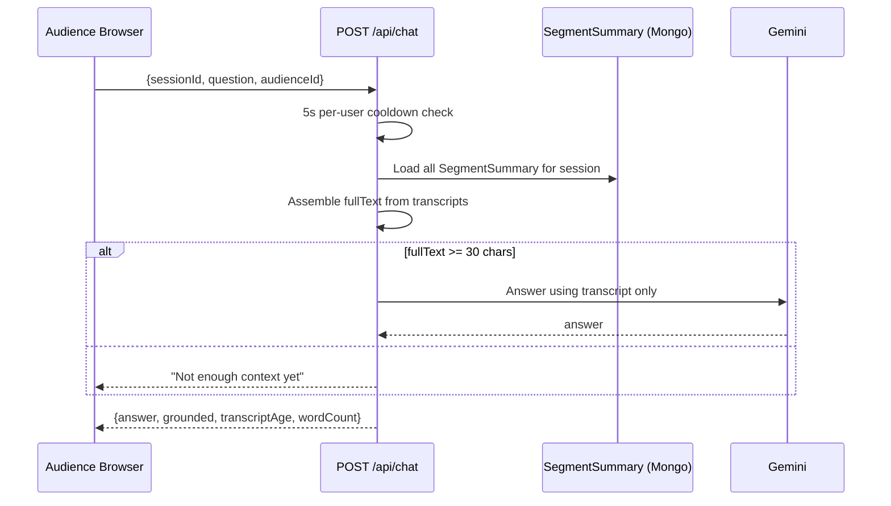
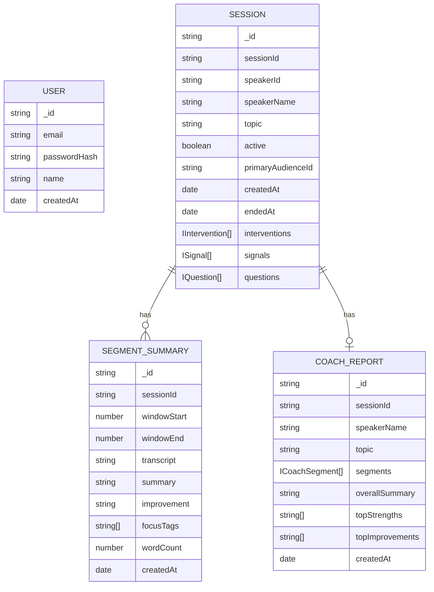
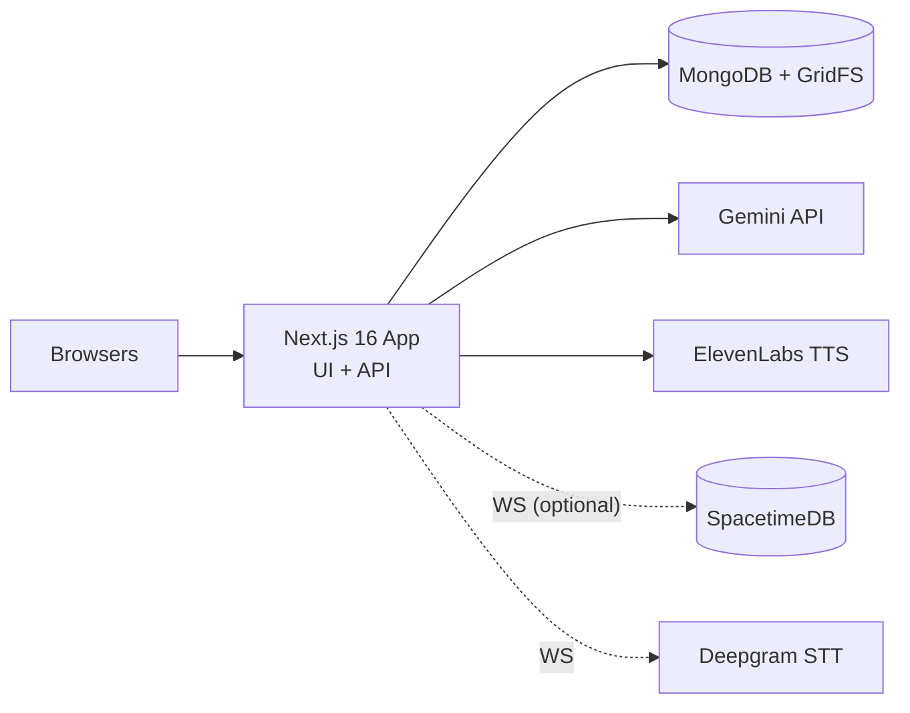

# PULSE — Architecture Plan

Last updated: 2026-04-04

## Executive Summary

PULSE is a real-time, AI-assisted "room whisperer" for live talks.

- Audience members send lightweight feedback (signals + questions) from their phones.
- Speaker and producer dashboards receive near-real-time updates via **Server-Sent Events (SSE)**.
- The system streams microphone audio to **Deepgram STT**, stores live captions in **SpacetimeDB** (with a local rolling buffer fallback), and rolls up a **60s caption summary** into MongoDB via Gemini.
- Interventions are generated via **Gemini reasoning** when confusion/pacing signals cross thresholds.
- After the session ends, a **Gemini coaching report** is compiled from all 60s segment summaries.

The current implementation is:

- **Next.js 16 (App Router)**: UI + API routes.
- **MongoDB (Mongoose)**: durable documents — sessions, interventions, segment summaries, coach reports, users.
- **GridFS**: durable audio blobs (TTS output, optional uploaded chunks).
- **SSE + in-memory state**: real-time fanout for signals, questions, and intervention events.
- **Gemini**: intervention reasoning, 60s segment summaries, transcript-grounded chat, coaching report compilation.
- **Deepgram**: realtime speech-to-text for live captions.
- **ElevenLabs**: TTS for high-urgency interventions (proxied via `/api/tts`).
- **SpacetimeDB (present, optional)**: realtime module + generated client bindings; powers live caption storage and the 60s summary pipeline.

Non-goals for this document: endpoints that do not exist under `app/api/`.

---

## System Context

```mermaid
graph LR
  Speaker[Speaker Browser] --> UI[Next.js UI]
  Producer[Producer Browser] --> UI
  Audience[Audience Browser] --> UI

  UI --> API[Next.js API Routes]

  API --> Auth[/api/auth/*]
  API --> SSE[/api/signals SSE fanout]
  API --> Sess[/api/session + /api/session/primary]
  API --> Summary[/api/summary]
  API --> Transcript[/api/transcript]
  API --> Audio[/api/audio/* optional]
  API --> Chat[/api/chat]
  API --> Intervene[/api/intervene]
  API --> Coach[/api/coach]
  API --> Questions[/api/questions]
  API --> TTS[/api/tts]

  Auth --> Mongo[(MongoDB)]
  Sess --> Mongo
  Intervene --> Mongo
  Summary --> Mongo
  Coach --> Mongo
  Audio --> Mongo

  Audio --> GFS[(GridFS: audio + tts buckets)]

  UI --> Deepgram[Deepgram STT]
  Chat --> Gemini[Gemini API]
  Intervene --> Gemini
  Summary --> Gemini
  Coach --> Gemini

  TTS --> ElevenLabs[ElevenLabs TTS]

  UI -. "WS (optional)" .-> STDB[(SpacetimeDB)]
```

### What's true in code today

- **Auth**: JWT stored in httpOnly cookie (`pulse_token`). Register/login/me/logout all implemented.
- **Transcript source of truth**: client-side Deepgram captions stored in SpacetimeDB + local rolling buffer. Every 60 seconds, captions are summarized via `/api/summary` and persisted to MongoDB as `SegmentSummary`.
- **Signals source of truth**: in-memory per Next.js process; clients subscribe via SSE (`/api/signals?sse=1`). Signals expire after 45s.
- **Primary judge system**: one audience device can be designated "primary" via `?primary=1` URL param or `/api/session/primary`. Only primary signals count toward intervention thresholds.
- **Questions**: in-memory, no moderation. Primary-only filter available for producer view.
- **Interventions**: persisted to MongoDB inside the `Session` document. 90s server-side cooldown + pending-ack guard.
- **Coach report**: compiled on session end from all `SegmentSummary` documents; stored in `CoachReport` collection.

---

## Project Modules (Repo-Level Architecture)



---

## Implemented API Surface (Current)

- **Auth**
  - `POST /api/auth/register` — create account, set httpOnly JWT cookie
  - `POST /api/auth/login` — verify credentials, set httpOnly JWT cookie
  - `GET /api/auth/me` — return current user from cookie
  - `DELETE /api/auth/me` — logout (clear cookie)

- **Session lifecycle**
  - `POST /api/session` — create session (speakerName, topic → sessionId)
  - `GET /api/session?sessionId=...` — fetch session info
  - `POST /api/session/start` — mark session active
  - `POST /api/session/end` — mark session ended; `reactivate: true` restarts it
  - `GET /api/session/primary?sessionId=...` — get primary audienceId
  - `POST /api/session/primary` — set primary audienceId

- **Signals (SSE)**
  - `POST /api/signals` — submit signal (10s rate limit per fingerprint)
  - `GET /api/signals?sessionId=...&sse=1` — SSE stream (snapshot + signal + intervention events)
  - `GET /api/signals?sessionId=...&snapshot=1` — raw signal array for client-side TTL filtering
  - `DELETE /api/signals?sessionId=...` — clear all signals, broadcast empty snapshot

- **Questions (in-memory)**
  - `POST /api/questions` — submit question (30s cooldown)
  - `GET /api/questions?sessionId=...&primaryOnly=1` — list questions, optional primary filter
  - `DELETE /api/questions?id=...` — delete single question
  - `DELETE /api/questions?sessionId=...` — clear all questions for session

- **Interventions**
  - `POST /api/intervene` — Gemini reasoning; 90s cooldown + pending-ack guard; optional ElevenLabs TTS; persists to MongoDB; SSE broadcast
  - `GET /api/intervene?sessionId=...` — last 10 interventions
  - `POST /api/intervene/ack` — acknowledge intervention (clears pending-ack guard)

- **Captions + summaries**
  - Deepgram streaming in speaker client → captions stored in SpacetimeDB + local buffer
  - `POST /api/summary` — summarize last 60s captions via Gemini → `SegmentSummary` in MongoDB
  - `GET /api/transcript?sessionId=...` — assemble full transcript from `SegmentSummary` documents

- **Coach report**
  - `POST /api/coach` — compile all `SegmentSummary` batches into `CoachReport` via Gemini; cached after first compile
  - `GET /api/coach?sessionId=...` — return cached `CoachReport` if exists

- **Transcript-grounded chat**
  - `POST /api/chat` — answers using `SegmentSummary` transcript only; heuristic fallback; 5s per-user cooldown

- **TTS**
  - `POST /api/tts` — ElevenLabs proxy with in-memory LRU cache (20 entries)

- **Audio (optional)**
  - `POST /api/audio/upload` — store MediaRecorder chunk in GridFS
  - `GET /api/audio/list?sessionId=...` — list uploaded chunks

---

## Component Architecture



---

## Key Data Flows

### 1) Audience Signal → SSE Fanout → Speaker/Producer Updates



### 2) Speaker Intervention Loop



### 3) Deepgram Live Captions → SpacetimeDB → 60s Summary → Coach Report



### 4) Audience Chat (Transcript-Grounded)



---

## Data Model

### MongoDB (durable)



### In-Memory (ephemeral, per process)

| Store | Key | Value | Notes |
|---|---|---|---|
| `__pulse_signals` | global array | `Signal[]` | TTL 45s, cleared on DELETE |
| `__pulse_sig_cooldowns` | `sessionId:fingerprint` | last signal timestamp | 10s cooldown |
| `__pulse_sse_clients` | `sessionId` | `Set<ReadableStreamDefaultController>` | SSE fanout |
| `__pulse_primary` | `sessionId` | `primaryAudienceId` | cached from DB |
| `__pulse_questions` | question id | `Question` | no TTL |
| `__pulse_tts_cache` | `voiceId:text` | `Buffer` | LRU, max 20 |

### GridFS (durable blobs)

- `audio` bucket — uploaded MediaRecorder chunks (optional).
- `tts` bucket — ElevenLabs TTS output for high-urgency interventions.

---

## UI Views

### Speaker View (`/speaker/[sessionId]`)

Single ambient circle indicator — the speaker's only job is to present.

```
┌─────────────────────────────────────────────────────┐
│ PULSE  Speaker  [mic picker]  [Transcript live ●]   │
│        [0 signals] [AI On] [Mic On] [CC On] [End]   │
├─────────────────────────────────────────────────────┤
│                                                     │
│              [ Start Session ]                      │
│                                                     │
│         ┌─────────────────────┐                     │
│         │   You're good       │  ← ambient circle   │
│         └─────────────────────┘                     │
│              Room is with you                       │
│                                                     │
│  ┌──────────────────────────────────────────────┐   │
│  │ Live captions          [Expand]              │   │
│  │ Listening…                                   │   │
│  └──────────────────────────────────────────────┘   │
│                                                     │
│  😕 2 Confused 40%   🐢 1 Too fast 20%             │
│                    [Clear signals]                  │
│                                                     │
│  ┌──────────────────────────────────────────────┐   │
│  │ AI whisper overlay (auto-dismiss 8s)         │   │
│  └──────────────────────────────────────────────┘   │
│                                                     │
│  /audience/{sessionId}  ← join URL                  │
└─────────────────────────────────────────────────────┘
```

On session end: spinner → `SessionReport` (coach report) renders inline.

### Producer View (`/producer/[sessionId]`)

Full analytics for a co-presenter or backstage operator.

```
┌──────────────────────────────────────────────────────────────┐
│ PULSE  Producer  [0 signals]  [Switch to Speaker]  [Dark]    │
├──────────────┬───────────────────────────────────────────────┤
│ Room Pulse   │  Presenting: {topic}                          │
│ [visualizer] │  {speakerName}                                │
│              │                                               │
│ Join         │  Pace: Too slow ──●────────── Too fast        │
│ [QR box]     │                                               │
│ /audience/…  │  Engagement: [static bar chart]               │
│              │                                               │
│ Captions     ├───────────────────────────────────────────────┤
│ {latest}     │  [AI] [Questions] [Clarify] [Poll]            │
│              │                                               │
│ Audio Chunks │  Questions tab: primary-judge Q list          │
│ {filenames}  │  with dismiss + clear-all                     │
│              │                                               │
│ Mood         │                                               │
│ No data yet  ├───────────────────────────────────────────────┤
│              │  Totals: Confused Clear Question Excited Slow │
└──────────────┴───────────────────────────────────────────────┘
```

### Audience View (`/audience/[sessionId]`)

Mobile-first, 3 tabs.

```
┌──────────────────────────┐
│ Audience                 │
│ {topic}                  │
│ with {speakerName}        │
│ [★ Primary judge]        │
├──────────────────────────┤
│ [React] [Ask] [Chat]     │
├──────────────────────────┤
│ React tab:               │
│  😕 Confused  ✅ Clear   │
│  🔥 Excited  🐢 Slow     │
│  ✋ Question             │
│  [10s cooldown]          │
│                          │
│ Ask tab:                 │
│  [textarea 200 chars]    │
│  [Submit question]       │
│  [30s cooldown]          │
│                          │
│ Chat tab:                │
│  [AI chat bubbles]       │
│  [Ask something…] [Send] │
└──────────────────────────┘
```

---

## Deployment Architecture



---

## Known Gaps (not yet implemented)

- `/api/poll`, `/api/mood`, `/api/clarify` — not implemented; UI stubs only in producer dashboard.
- ArmorIQ enforcement layer — not implemented.
- Gemini content moderation for questions — questions are unmoderated.
- QR code rendering — placeholder box in producer dashboard.
- Engagement timeline — static decorative bars, not driven by real data.
- Horizontal scaling — in-memory SSE state and signals are per-process; not suitable for multi-instance deployment.

---

## Not Currently Used (present in repo)

- **Audio chunk uploads**: `/api/audio/upload` and `/api/audio/list` exist; producer dashboard polls the list, but transcription is driven by Deepgram live captions, not uploaded audio.
- **SpacetimeDB as primary state**: SpacetimeDB is used for caption storage; signals and questions use in-memory state + SSE.
