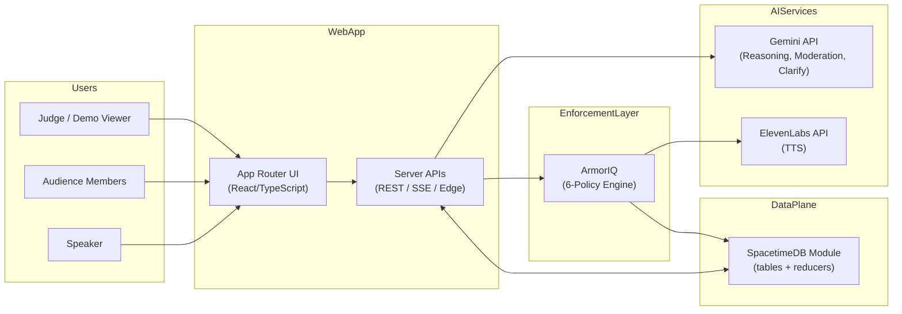
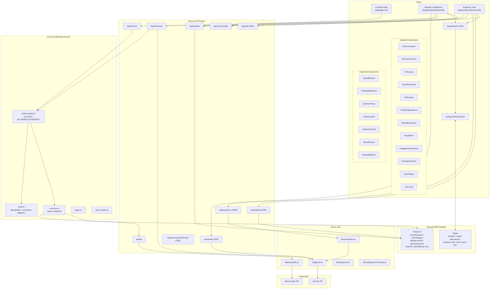
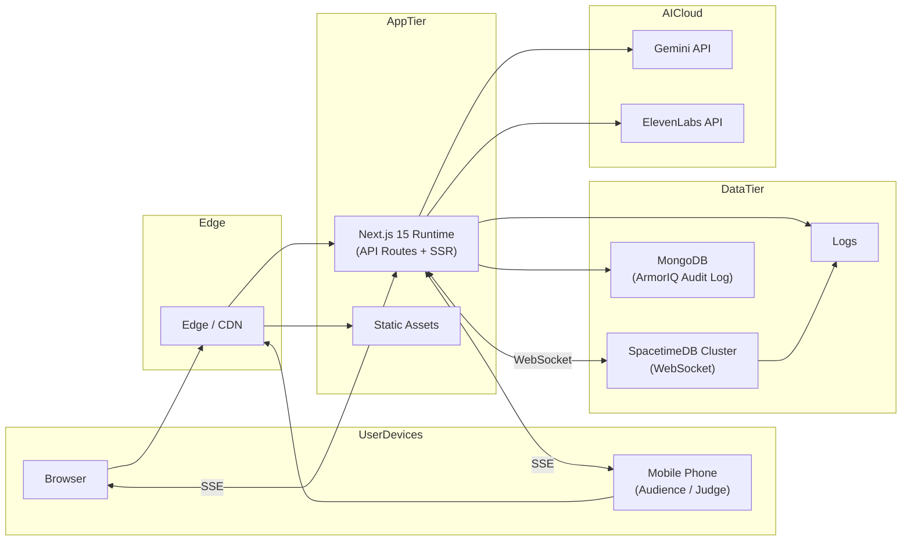
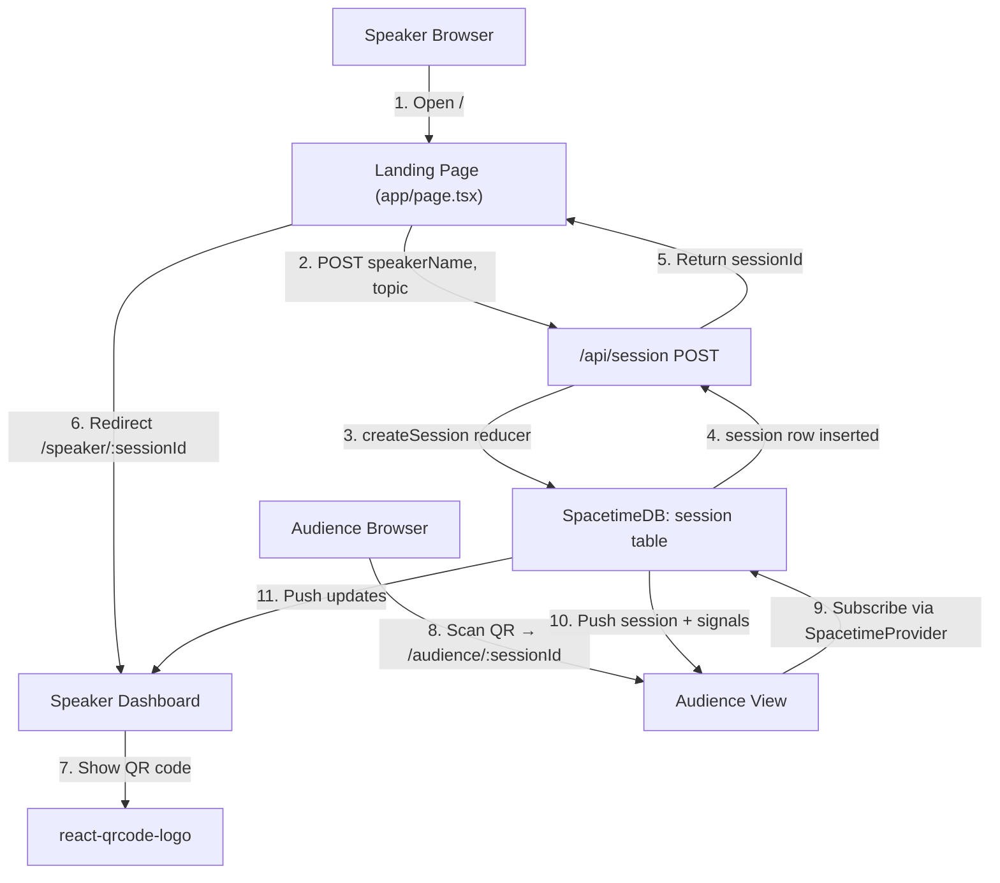
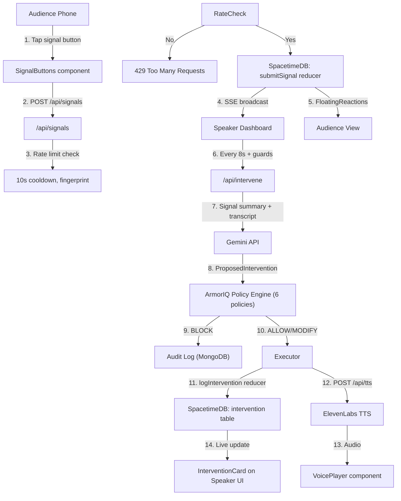
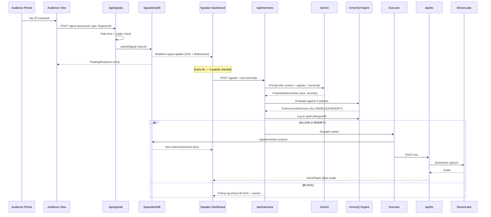
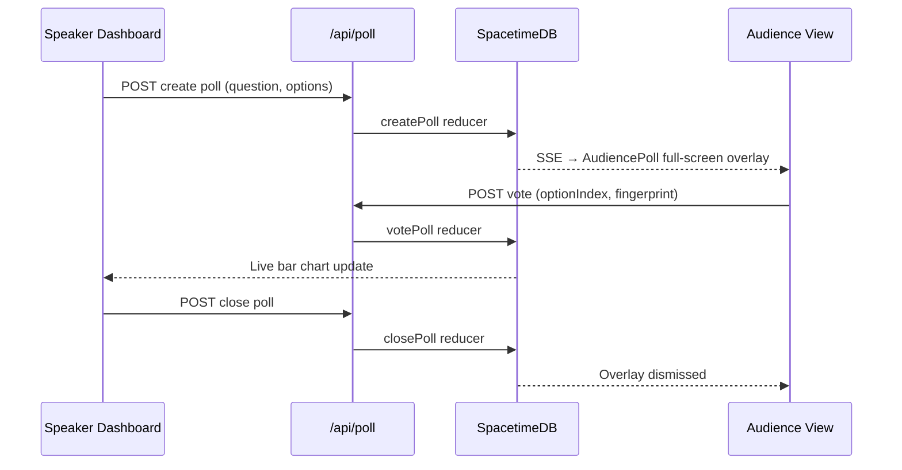
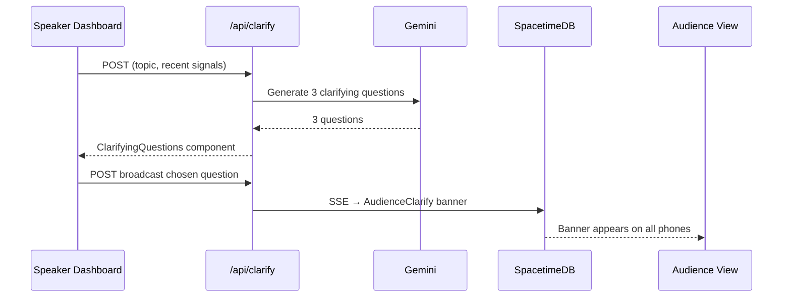
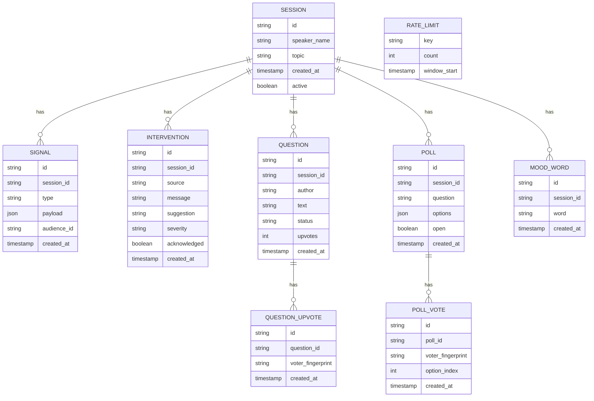
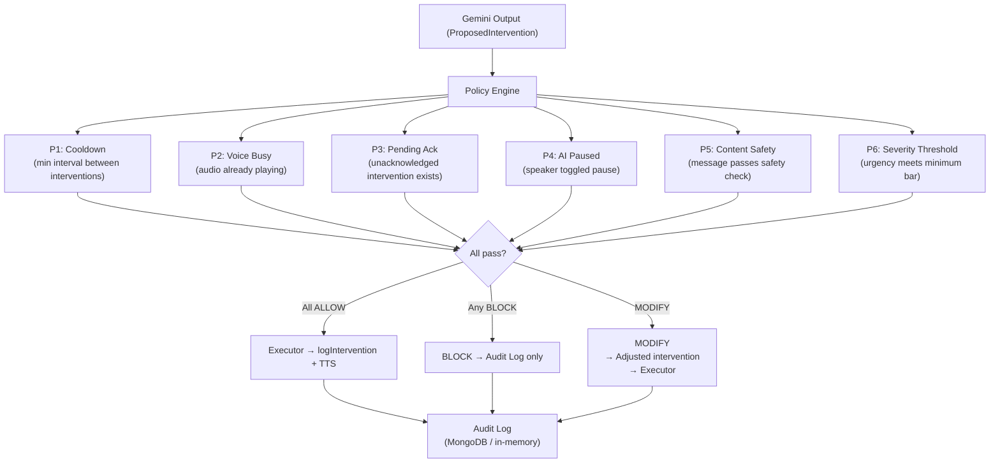

## Executive Summary

PULSE is a real-time, AI-augmented "room whisperer" that helps speakers monitor audience engagement and receive just-in-time coaching during live sessions. The system combines a Next.js 15 web application, SpacetimeDB for low-latency state synchronization, AI services (Gemini and ElevenLabs), and ArmorIQ — a custom 6-policy enforcement layer that gates every AI-generated intervention before it reaches the speaker.

The architecture is cloud-native, event-driven, and optimized for real-time collaboration: speakers and audiences connect via web clients, all shared state lives in SpacetimeDB, AI services are orchestrated via stateless server-side APIs, and every proposed intervention passes through the ArmorIQ policy engine before execution.

---

## System Context

### System Context Diagram

### Explanation

- **External actors**
  - Speaker: creates sessions, views interventions, engagement metrics, polls, questions, and AI coaching.
  - Audience members: join via QR code, send signals (mood, questions, polls, example requests).
  - Judge: participates as audience; same UI.

- **Core system**
  - Next.js 15 app (App Router) serves UI and all server APIs.
  - SpacetimeDB hosts all shared, real-time state via WebSocket subscriptions.
  - Gemini API handles reasoning, intervention generation, content moderation, and clarifying question generation.
  - ElevenLabs API synthesizes voice for interventions.
  - ArmorIQ sits between Gemini output and execution — every proposed intervention is evaluated against 6 policies before being delivered.

- **Interactions**
  - Users interact via browser → Next.js UI → APIs.
  - APIs read/write state through SpacetimeDB reducers.
  - Gemini output flows through ArmorIQ before any action is taken.
  - SpacetimeDB pushes live updates to connected clients via WebSockets.
  - SSE streams (`/api/signals`, `/api/questions`, `/api/poll`, `/api/mood`, `/api/interventions/stream`) broadcast real-time events to clients that can't use WebSockets directly.

### NFR Coverage

- **Scalability**: Stateless APIs; SpacetimeDB cluster; AI services scale independently.
- **Performance**: WebSocket-based SpacetimeDB updates; SSE for lightweight broadcast; minimal server-side logic in hot paths.
- **Security**: Sessions scoped by opaque IDs; environment secrets for AI APIs; ArmorIQ blocks policy-violating interventions; device fingerprinting for abuse prevention.
- **Reliability**: Centralized state in SpacetimeDB; stateless Next.js layers; graceful degradation if AI is down; ArmorIQ in-memory fallback for audit log.
- **Maintainability**: Clear separation between UI, APIs, SpacetimeDB module, AI orchestration, and enforcement layer.

---

## Architecture Overview

PULSE follows a **hub-and-spokes** architecture with an enforcement gate:

- Next.js 15 app is the interaction hub.
- SpacetimeDB acts as the real-time data backbone.
- AI services (Gemini, ElevenLabs) are downstream "spokes" invoked via well-defined server APIs.
- ArmorIQ enforcement layer intercepts all AI-proposed interventions before execution.
- Clients are thin: they subscribe to state (via SpacetimeProvider + useSpacetimeSession) and render views.

Key patterns:

- **Event-driven**: Audience actions → signals written into SpacetimeDB → AI processors react and generate interventions → ArmorIQ evaluates → executor dispatches.
- **CQRS-style separation**: Reducers for writes; subscriptions/hooks for reads.
- **Policy-gated execution**: No AI output reaches the speaker or SpacetimeDB without passing ArmorIQ's 6-policy evaluation.
- **SSE for lightweight broadcast**: Signals, questions, polls, mood, and intervention streams use Server-Sent Events for clients that don't need full WebSocket state.

---

## Component Architecture

### Component Diagram

### Component Responsibilities

- **Client — Speaker Components**
  - `PulseVisualizer`: Animated circle + per-signal-type bars driven by SpacetimeDB `onInsert` callbacks.
  - `InterventionCard`: Shows AI message, suggestion, urgency badge, acknowledge button.
  - `PolicyLog`: Live ArmorIQ enforcement decisions with ALLOW/BLOCK/MODIFY badges.
  - `QuestionQueue`: Audience questions sorted by upvotes; dismiss/answered actions.
  - `PollCreator`: Speaker creates polls; live bar chart results.
  - `ClarifyingQuestions`: 3 AI-generated questions; speaker picks one to broadcast.
  - `MoodWordCloud`: Live CSS/SVG word cloud from audience mood responses.
  - `PaceMeter`: slow_down vs excited ratio → pace indicator.
  - `EngagementTimeline`: Live SVG chart of sentiment over time.
  - `ExampleCounter`: Shows how many audience members need an example.
  - `VoicePlayer`: Plays ElevenLabs audio, fires `onDone` callback.
  - `QRCode`: Audience join URL via `react-qrcode-logo`.

- **Client — Audience Components**
  - `SignalButtons`: 5 emoji buttons (confused, clear, excited, slow_down, question).
  - `FloatingReactions`: Emoji reactions drift up the screen as signals arrive via SSE.
  - `QuestionInput`: Textarea with 200-char limit, cooldown UI, moderation feedback.
  - `AudiencePoll`: Full-screen overlay when a poll is active.
  - `AudienceClarify`: Banner when speaker broadcasts a clarifying question.
  - `MoodPrompt`: Overlay triggered 1.5s after an AI intervention.
  - `ExampleButton`: Tap "I need an example"; threshold of 3 fires AI immediately.

- **Server — API Routes**
  - `/api/session`: POST create / GET fetch session; delegates to `createSession` reducer.
  - `/api/signals`: POST signal submission + SSE broadcast to speaker; rate limiting (10s cooldown); outlier detection + variance tracking.
  - `/api/intervene`: Receives signals + live transcript → Gemini → ArmorIQ → executor.
  - `/api/tts`: Proxies text to ElevenLabs, returns audio.
  - `/api/enforce`: Standalone POST for ArmorIQ evaluation + execution; GET for audit log.
  - `/api/questions`: Submit (with Gemini moderation + rate limit), upvote, dismiss, answered, SSE stream.
  - `/api/poll`: Create, vote, close, SSE stream.
  - `/api/clarify`: Gemini generates 3 clarifying questions; broadcast chosen one via SSE.
  - `/api/mood`: Collect mood words; SSE stream to speaker.
  - `/api/interventions/stream`: SSE stream to audience phones for mood prompt trigger.

- **Server Libs**
  - `lib/gemini.ts`: `analyzeAndIntervene` — signal summary → Gemini → intervention result.
  - `lib/elevenlabs.ts`: TTS proxy.
  - `lib/moderation.ts`: Gemini content moderation for audience questions.
  - `lib/fingerprint.ts`: SHA-256 device fingerprinting for abuse prevention.
  - `lib/useSpeechTranscript.ts`: Buffers last 60s of speaker speech in memory.

- **ArmorIQ — Enforcement Layer**
  - `types.ts`: `ProposedIntervention`, `EnforcementDecision`, `SessionPolicyState`, `PolicyEvaluation`, `ExecutionResult`, `AuditLogEntry`.
  - `policy-engine.ts`: 6 pure policies, ALLOW / BLOCK / MODIFY outcomes.
  - `executor.ts`: Action dispatch map, gated behind `EnforcementDecision`.
  - `audit.ts`: MongoDB with in-memory fallback.
  - `demo-seeds.ts`: Pre-built ALLOW, BLOCK, MODIFY scenarios for demo.

- **SpacetimeDB Module**
  - **Tables**: `session`, `signal`, `intervention`, `question`, `question_upvote`, `poll`, `poll_vote`, `mood_word`, `rate_limit`.
  - **Reducers**: `createSession`, `submitSignal`, `logIntervention`, `acknowledgeIntervention`, `submitQuestion`, `upvoteQuestion`, `dismissQuestion`, `answerQuestion`, `submitMood`, `createPoll`, `votePoll`, `closePoll`, `endSession`.

---

## Deployment Architecture

### Deployment Diagram

### Explanation

- **Environments**: Dev and production share the same topology; differ in scale and credentials.
- **Network boundaries**:
  - Public internet → Edge/CDN → Next.js runtime (public zone).
  - Next.js runtime → SpacetimeDB (protected zone, WebSocket).
  - Next.js runtime → MongoDB (protected zone, ArmorIQ audit persistence).
  - Next.js runtime → AICloud (outbound-only HTTPS to external providers).
- **Mobile-first audience**: Audience and judges connect on phones via QR code; SSE streams deliver real-time updates without requiring a persistent WebSocket per client.

---

## Data Flow

### Data Flow Diagram — Session Creation & Participation

### Data Flow Diagram — Signal → ArmorIQ → Intervention

---

## Key Workflows

### Sequence Diagram — Audience Signal → AI Intervention → Voice

### Sequence Diagram — Poll Lifecycle

### Sequence Diagram — Clarify Flow

---

## Additional Diagrams

### Domain Model (ERD) — SpacetimeDB Schema

### ArmorIQ Policy Engine — Decision Flow

---

## Phased Development

### Phase 0 — Scaffolding (Complete)
- Next.js 15 + TypeScript + Tailwind CSS v4.
- SpacetimeDB module: all tables and reducers defined.
- `SpacetimeProvider` and `useSpacetimeSession` hook.
- `.env.local` structure with all required keys.

### Phase 1 — Session Management (Complete)
- `lib/session.ts`: 12-character session ID generation.
- `/api/session`: POST create / GET fetch.
- Landing page, audience shell, speaker shell.
- Basic session lifecycle: create, join by URL, display header.

### Phase 2 — Real-Time Signals
- `SignalButtons`, `FloatingReactions`, `PulseVisualizer` components.
- `/api/signals` with SSE broadcast, rate limiting (10s cooldown), outlier detection.
- `lib/fingerprint.ts` for device-based abuse prevention.
- Wire audience → `submitSignal` reducer → speaker dashboard.

### Phase 3 — AI Intervention Engine
- `lib/gemini.ts`, `lib/elevenlabs.ts`, `lib/useSpeechTranscript.ts`.
- `/api/intervene`, `/api/tts`.
- `VoicePlayer`, `InterventionCard` components.
- Periodic intervention check (every 8s) with 4 guards.
- AI pause toggle + mic toggle on speaker header.

### Phase 4 — ArmorIQ Enforcement Layer
- `lib/enforcement/types.ts`, `policy-engine.ts`, `executor.ts`, `audit.ts`, `demo-seeds.ts`.
- `/api/enforce` route.
- `PolicyLog` component + 🛡️ Policy tab on speaker dashboard.
- Wire enforcement into `/api/intervene` pipeline.

### Phase 5 — Questions & Moderation
- `lib/moderation.ts` (Gemini content moderation).
- `/api/questions` with SSE, moderation, rate limiting.
- `QuestionInput`, `QuestionQueue` components.
- Wire upvoting to `upvoteQuestion` reducer.

### Phase 6 — Polls, Clarify, Mood
- `/api/poll`, `/api/clarify`, `/api/mood` routes with SSE.
- `PollCreator`, `AudiencePoll`, `ClarifyingQuestions`, `AudienceClarify`, `MoodPrompt`, `MoodWordCloud` components.

### Phase 7 — Engagement Metrics & UX Polish
- `PaceMeter`, `EngagementTimeline`, `ExampleButton`, `ExampleCounter` components.
- `/api/interventions/stream` SSE route.
- QR code on speaker dashboard.
- Audience page tabs (React / Ask), cooldown countdown, error states.
- Speaker dashboard tab badges, auto-switch on first question, signal totals grid.

### Phase 8 — Demo Seeds & Hardening
- Demo seed data for ArmorIQ (ALLOW, BLOCK, MODIFY scenarios).
- Tune intervention thresholds for small audiences (3–5 judges): `uniqueContributors >= 2`, `confusionRate >= 40%`.
- ElevenLabs volume/latency verification.
- SpacetimeDB WebSocket stability on mobile hotspot.
- Final cleanup: remove console.logs, verify TypeScript, document all env vars.

---

## Non-Functional Requirements Analysis

### Scalability
- Stateless Next.js APIs; horizontal scaling via containers/serverless.
- SpacetimeDB designed for real-time, multi-client scenarios.
- AI calls rate-limited and batched; ArmorIQ is pure/stateless per evaluation.

### Performance
- WebSockets minimize polling; only deltas propagate to clients.
- SSE for lightweight one-way broadcast (signals, questions, polls, mood).
- Reducers keep business logic close to data, reducing round-trips.
- CDN and static asset optimization for fast initial load.

### Security
- Environment variables for all secrets; no keys in client bundle.
- Opaque session IDs; device fingerprinting for rate limiting.
- ArmorIQ blocks policy-violating interventions before execution.
- Future-ready for JWT/OAuth around moderator/speaker roles.

### Reliability
- Single source of truth in SpacetimeDB.
- Stateless app tier; straightforward blue/green deployments.
- AI failures degrade gracefully; ArmorIQ has in-memory fallback for audit log.
- 4 guards on intervention check prevent runaway AI calls.

### Maintainability
- Clear module boundaries: UI / API routes / server libs / SpacetimeDB module / ArmorIQ.
- Strong domain schema in SpacetimeDB maps to business language.
- App Router route structure aligns with business screens (speaker, audience).
- ArmorIQ policies are pure functions — easy to test and extend.

---

## Risks and Mitigations

- **AI dependency risk**: Gemini or ElevenLabs outages.
  - Mitigation: Fallback to text-only interventions; circuit breakers; AI pause toggle.
- **ArmorIQ over-blocking**: Policies too aggressive for small demo audiences.
  - Mitigation: Tune thresholds for 3–5 judges; demo seeds bypass real signal requirements.
- **Real-time complexity**: Race conditions or state drift across WebSocket + SSE channels.
  - Mitigation: Centralize all writes in reducers; strict typing; replay tools.
- **Cost risks**: Gemini + ElevenLabs usage can spike.
  - Mitigation: Rate limiting; 8s intervention interval; cooldown guards in ArmorIQ.
- **Mobile network instability**: Judges on hotspot may drop WebSocket.
  - Mitigation: SpacetimeDB reconnect logic; SSE as fallback for audience-side updates.

---

## Technology Stack

- **Frontend**: Next.js 15 (App Router), React 19, Tailwind CSS v4, `react-qrcode-logo`, Web Speech API.
- **Real-Time**: SpacetimeDB (`@clockworklabs/spacetimedb-sdk`), Server-Sent Events.
- **AI**: Gemini API (reasoning, moderation, clarify), ElevenLabs API (TTS).
- **Enforcement**: ArmorIQ — custom policy engine (`lib/enforcement/`), MongoDB + in-memory audit log.
- **Utilities**: SHA-256 device fingerprinting, 60s rolling speech transcript buffer.
